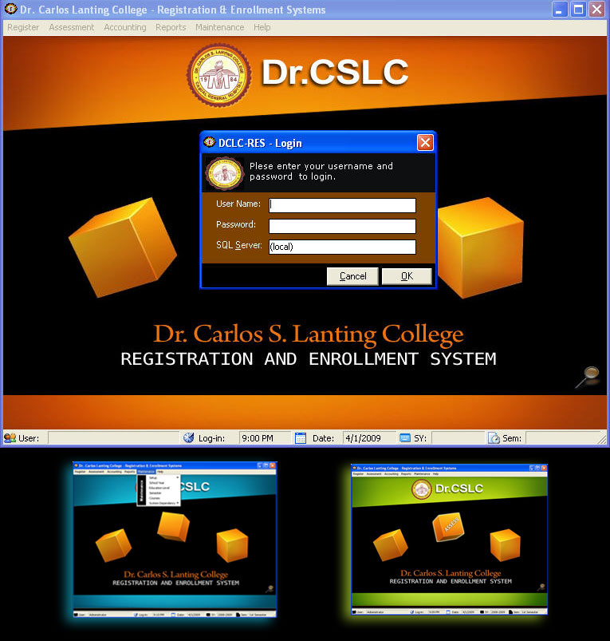



## Registration and Enrolment System \- Thesis Version

### Description

Title: Registration and Enrolment System - Thesis Version

Description: Since enrolment system is not that big system so included the Registration as well to

make more interesting to use. Some functions of this software are as follows:

a) Client/Server Capable using MS SQL 2005 or later.

b) Automatic computation of tuition and other fees.

c) Interface with other system such as Scheduling System, Grading System and the like.

d) Neatly done reports.

e) Uses reusable codes.

f) Much much more to find out....
 
### More Info
 

             |
---                |---
**Submitted On**   |2009-04-02 00:49:44
**By**             |[Jeffrey Lim](https://github.com/Planet-Source-Code/PSCIndex/blob/master/ByAuthor/jeffrey-lim.md)
**Level**          |Intermediate
**User Rating**    |4.8 (19 globes from 4 users)
**Compatibility**  |VB 6\.0
**Category**       |[Complete Applications](https://github.com/Planet-Source-Code/PSCIndex/blob/master/ByCategory/complete-applications__1-27.md)
**World**          |[Visual Basic](https://github.com/Planet-Source-Code/PSCIndex/blob/master/ByWorld/visual-basic.md)
**Archive File**   |[Registrati214829412009\.zip](https://github.com/Planet-Source-Code/jeffrey-lim-registration-and-enrolment-system-thesis-version__1-71936/archive/master.zip)

